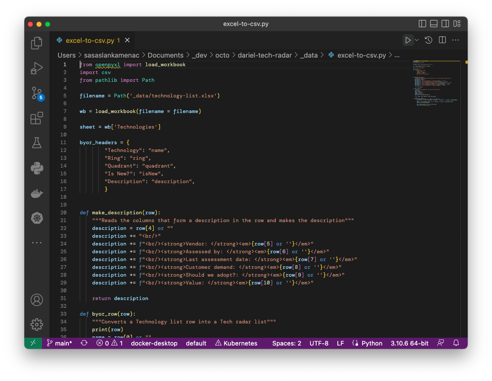

To update [the list UI data](https://radar.thoughtworks.com/?sheetId=https%3A%2F%2Fd2sgiotyre0y0p.cloudfront.net%2Ftechnology-list.csv)

1. Download TECH LIST .xlsx 

1. save into this directory as technology-list.xlsx

1. convert to .csv with python script

* (optional python envioronment setup)

      pip install openpyxl/usr/local/bin/python[version] /[path to repo]/_data/excel-to-csv.py 

* run python script via VSC play button `≥` top RH UI corner 

      /usr/local/bin/python[version] /[path to repo]/_data/excel-to-csv.py 

python π - ENDS

4. upload to S3 dariel AWS sandbox

      aws s3 cp _data/technology-list.csv s3://dariel-octo-tech-radar/technology-list.csv --profile darielsandbox

loads from (same link as top/above):
https://radar.thoughtworks.com/?sheetId=https%3A%2F%2Fd2sgiotyre0y0p.cloudfront.net%2Ftechnology-list.csv

  
