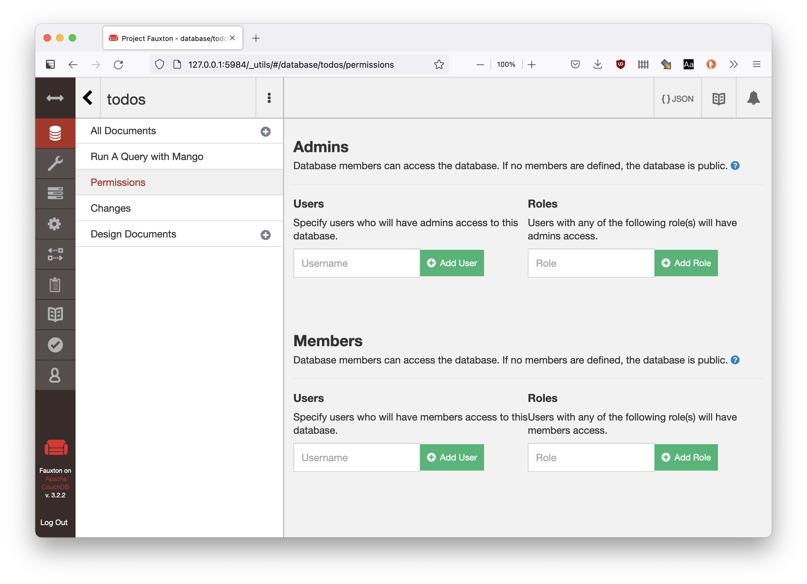

pouchdb-getting-started-todo
============================
## Pre-requisite

CouchDB https://couchdb.apache.org/#download

## Main

From this directory run:

     http-server

view here:

http://localhost:8080

then run CouchDB ~/server 

or

set up CouchDB via UI create a 'todos' database **public** access 

  
