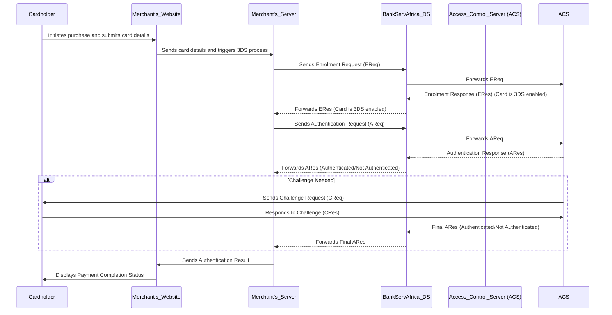

Based on the information provided and the content of the documents, there are no additional steps outlined in the documents between receiving the Enrolment Response (ERes) and sending the Authentication Request (AReq). The process as described in the documentation can be represented as follows:

### Detailed Enrolment and Authentication Protocol Integration (Based on Documentation)

### Explanation

1. **Enrolment Request (EReq)**:
   - The Merchant's server sends an Enrolment Request to the BankServAfrica Directory Server (DS) to check if the card is enrolled in the 3D Secure program.

2. **Forwarding Enrolment Request**:
   - The DS forwards the Enrolment Request to the Access Control Server (ACS) managed by the card issuer.

3. **Enrolment Response (ERes)**:
   - The ACS processes the Enrolment Request and responds back to the DS, indicating whether the card is enrolled in the 3D Secure program.

4. **Forwarding Enrolment Response**:
   - The DS forwards the Enrolment Response back to the Merchant's server, confirming the card's Enrolment status.

5. **Authentication Request (AReq)**:
   - After confirming the card's Enrolment, the Merchant's server sends an Authentication Request to the DS.

6. **Forwarding Authentication Request**:
   - The DS forwards the Authentication Request to the ACS.

7. **Authentication Response (ARes)**:
   - The ACS processes the Authentication Request and sends an Authentication Response back to the DS, indicating whether the authentication was successful.

8. **Forwarding Authentication Response**:
   - The DS forwards the Authentication Response back to the Merchant's server.

9. **Challenge Process** (if needed):
   - If additional verification is needed, the ACS sends a Challenge Request to the cardholder.
   - The cardholder responds to the Challenge Request, and the ACS processes this response.
   - The ACS sends the final Authentication Response back to the DS, which forwards it to the Merchant's server.

10. **Completion**:
    - The Merchant's server sends the authentication result to the Merchant's website.
    - The Merchant's website displays the payment completion status to the cardholder.

If the documentation does not specify additional steps between receiving ERes and sending AReq, it is safe to proceed with the assumption that the process directly transitions from confirming Enrolment to initiating authentication.